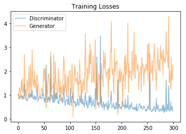

# Celeb-Face-Generation
A PyTorch Implementation of DCGAN on a dataset of celebrity faces.
In this project, DCGAN on a dataset of faces is built and trained for a generator network to generate new images of faces that look as realistic as possible by optimizing loss of a discriminator network 
The project consists of data loading, defining , training adversarial network and visualizing the results of trained Generator to see how it performs; generated face samples look like fairly realistic faces with small amounts of noise.

## Data Set
[DataSet](http://mmlab.ie.cuhk.edu.hk/projects/CelebA.html)
CelebFaces Attributes Dataset (CelebA) is a large-scale face attributes dataset with more than 200K celebrity images. For this project, each of the CelebA images has been cropped to remove parts of the image that don't include a face, then resized down to 64x64x3 NumPy images.

## Implementation Approach 
### DATA Loading and Processing 
* get_dataloader(): transform image data into resized, squared Tensor image types(image_size X image_size) and return a DataLoader that shuffles and batches according to batch_size these Tensor images.
* image_size is 32. Resizing the data to a smaller size is processed in order to make for faster training
```python
transform = transforms.Compose([transforms.Resize(image_size), # resize to 128x128
                                    transforms.CenterCrop(image_size),
                                    transforms.RandomHorizontalFlip(),
                                    transforms.ToTensor()])
train_dataset = datasets.ImageFolder(train_path, transform)
train_loader = DataLoader(dataset=train_dataset, batch_size=batch_size, shuffle=True, num_workers=num_workers)
```
* scale() : scales images into a pixel range of -1 to 1. Since the output of a tanh activated generator contain pixel values in a range from -1 to 1, thus rescaling training images to a range of -1 to 1 is required.

### Build Adversarial Network 
### Discriminator Class
* Input is 32x32x3 Tensor images 
* Applied a deep network with "normalization" to deal with complex data 
* Only applied convolutional layers without MaxPooling layers
* Applied Leaky ReLU with alpha=0.2 as the activation function for the convolution layers which helps with the gradient flow. It helps alleviate the problem of sparse gradients.
* Applied same size filters across all the Convolutional layers.
* Applied batch normalization to avoid "internal covariate shift", which stabilizes GAN training.
* Output is one value that will determine whether an image is real or fake.

### Generator Class 
* Input is vector of some length z_size 
* This generaotr upsamples an input and generates a new image of the same size as training image(32x32x3)
* Applied batch norm to stabilize GAN training.
* Applied ReLU in order to combat the vanishing gradient problem.
* Used transposed convolutions to upsample the image.
* Output is an image of the same shape as the processed training data (32x32x3).

### Weights Initialization
From the DCGAN paper, the authors specify that all model weights shall be randomly initialized from a Normal distribution with mean=0, stdev=0.02. Thus, 
* initialize only convolutional and linear layers
* Initialize the weights to a normal distribution, centered around 0, with a standard deviation of 0.02.
* The bias terms, if they exist, may be left alone or set to 0.
```python
def weights_init_normal(m):
    classname = m.__class__.__name__
    if hasattr(m, 'weight') and (classname.find('Conv') != -1 or classname.find('Linear') != -1):
        init.normal_(m.weight.data, mean=0.0, std=0.02)
        if hasattr(m, 'bias') and m.bias is not None:
            init.constant_(m.bias.data, 0.0)
```
### Loss and Optimization
* For the discriminator, the total loss is the sum of the losses for real and fake images, d_loss = d_real_loss + d_fake_loss.
* The generator loss will look similar only with flipped labels. The generator's goal is to get the discriminator to think its generated images are real.
* Loss function take in the outputs from a discriminator and return the real or fake loss.
* Applied smooth real_loss by setting labels = torch.ones(batch_size) * (1 - smooth)
* Created two separate Adam optimizer: one for the discriminator D and the other one for the generator G
* Two optimizers are used for updating the weights of the discriminator and generator.

### Training
* The training loop alternates between training the discriminator and generator networks.


